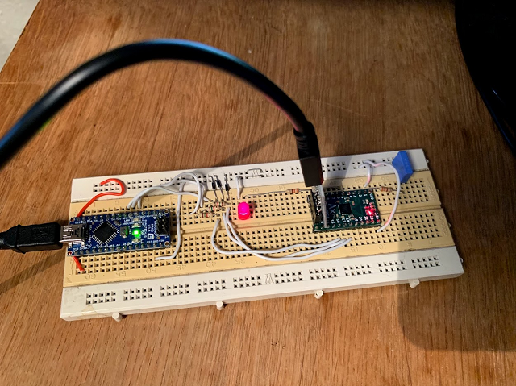
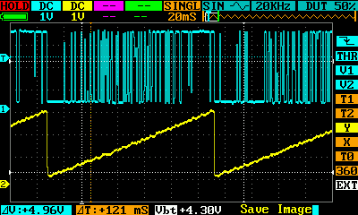

**2019.01.27**

Started to add an external interface that will provide evenutally control for the synth. After some consideration I have settled for an SPI which, at the moment, has only the M->S part implemented as I don't expect to read from the synth. I'm developing on a XO2-256 which provides an SPI embedded function block, however I decided to have this in verilog to keep the design more portable. I might reconsider shoud I start to be short on LUTs. 

I added a simple controller built on an Arduino Nano to drive the SPI and, just for testing, wired directly what ever data byte comes from the SPI to the amplitude register of the PDM encoder. First tests look good, got a nice ramp driven from the controller. 

**2019.01.13**

Done some first tests with the PDM encoder. Got a smooth sawtooh going with 100n+330R LP filter on the output. The scope trace can't capture the pulses properly as they are too high freq.

